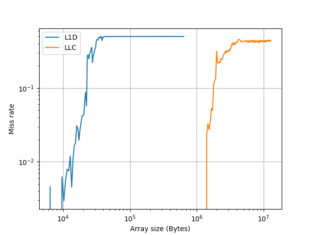

# Cyclops

A minimal microbenchmarking tool for Linux build directly on top of 
`perf_event_open()` and timers like `rdtscp`.

## Motivation

I built **cyclops** because I wanted a small, accurate microbenchmarking
framework for measuring C code.

## Build and Run

```bash
# clone repository
git clone https://mattjoman/cyclops.git cyclops

# enter repository
cd cyclops

# build
make

# run
./cyclops -w STRIDED_ARRAY -g IPC -p array-elements=1000
```

## Benchmarking Methodology

The following methods are used to maximise benchmark accuracy and minimise
measurement noise:

- Pin thread to a single core
- Warmup runs to train branch predictors and warm caches (set from the cli)
- Barriers and serialization to ensure the compiler or CPU don't reorder
  workload instructions outside the measurement window
- Detect kernel multiplexing physical PMU counters with `time_running` and
  `time_enabled`, and scale results if necessary (for `perf_event_open()`)

See the benchmarking code in the metric backends in `core/metric/`.

## Example Experiments

The `cyclops` tool is designed to be highly scriptable, and make it easy to
design performance & microarchitecture experiments.

In `experiments/` there are example Python scripts for running experiments.
To run these experiments, you will first need to build the `cyclops` binary
(see above).

You will then need to create a Python virtual environment and install the
necessary packages:

```bash
cd experiments
python -m venv venv
pip install -r requirements.txt
```

Before running experiments, activate the virtual environment you just created:

```bash
source venv/bin/activate
```

## L1 Cache and LLC Size Estimation

This experiment uses the `STRIDED_ARRAY` workload, sweeping through increasing
array sizes, to estimate L1D and LLC capacities.

This experiment can be run with:

```bash
python estimate_cache_size.py
```

### Results



As the array size increases, and exceeds the size of a cache, the cache can no
longer hold all the data.
Some will need to be fetched from other caches or DRAM, resulting in an
increase in the cache miss rate at this point.

Here we can see that there is a large jump in the L1D miss rate when the array
is ~2-3\*10^4 Bytes, and a large jump in LLC miss rate at ~2\*10^6.

From this, we can estimate that my L1D is probably 32KB and my LLC is in the
range of 2MB.

## Ouput

### CSV File

Aggregated batch results (min, max, median for each metric in the selected
metric group) will be written to a CSV file if the `-o <filename>` arguments
are passed.
The file will contain metadata like the workload, metric group and any workload
parameters (metadata lines start with "#" and are at the top of the file).

### Batch Summary (`stdout`)

Aggregate values and metadata for the batch will be written to `stdout`.

## Project Roadmap

### Milestone 1 - Reliable single-threaded benchmarking

- single-threaded measurement accuracy & reliability
- a simple cli tool allowing users to design benchmark experiments
- a simple workload API so users can measure custom code

### Milestone 2 - Multithreaded update

- support multithreaded workloads
- accurate per-thread metrics
